# HPC: Azure-Cycle-Cloud-vs-AWS-Parallel-Cluster

## Overview
In this tutorial, you will go through the basics of using AWS Parallel Cluster. This tutorial will walk you through how to create and connect to a HPC cluster in AWS and a use case on how to submit an HPC job. We will be using the problem of finding the smallest prime factor as an example

### Step 0: Before You Start 
* Sign up for a free AWS account here [AWS Account Sign Up](https://aws.amazon.com/free/?trk=7d839240-0f22-461a-924a-bd9f4c9f3138&sc_channel=ps&s_kwcid=AL!4422!10!71399763847723!71400284985686&ef_id=bc458f06349b10643121eb2a92f9869c:G:s&all-free-tier.sort-by=item.additionalFields.SortRank&all-free-tier.sort-order=asc&awsf.Free%20Tier%20Types=*all&awsf.Free%20Tier%20Categories=*all)

### Step 1: Deploy ParallelCluster UI - 20 minutes to deploy
* Create UI stack [here](https://us-east-2.console.aws.amazon.com/cloudformation/home?region=us-east-2#/stacks/create/review?stackName=parallelcluster-ui&templateURL=https://parallelcluster-ui-release-artifacts-us-east-1.s3.us-east-1.amazonaws.com/parallelcluster-ui.yaml)
* Update the field AdminUserEmail with a valid email to receive a temporary password in order to connect to the ParallelCluster UI GUI
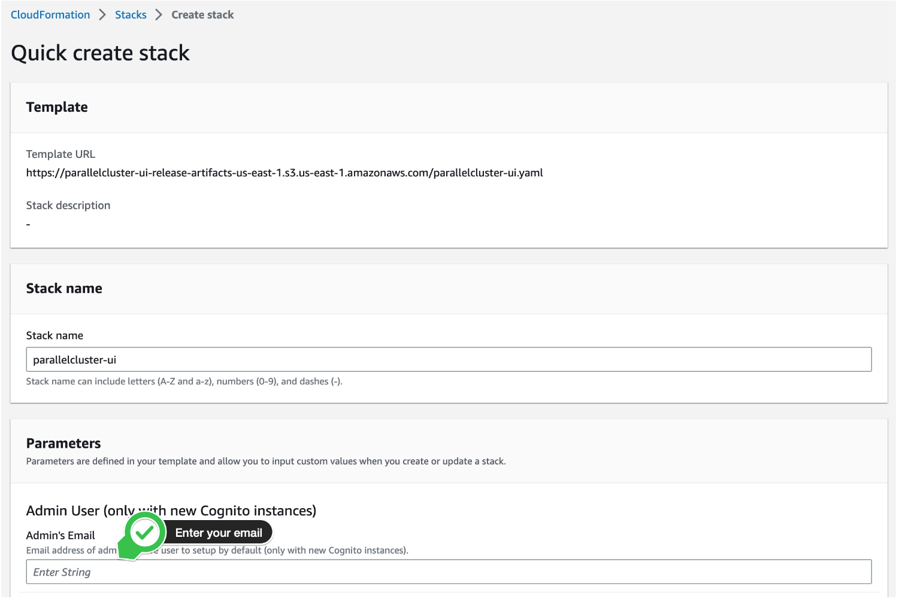
* Leave the other default values and proceed through the next few pages till you are at stage 4
* At stage 4 click the two tick boxes to create new IAM resources
* Then click **Create stack **
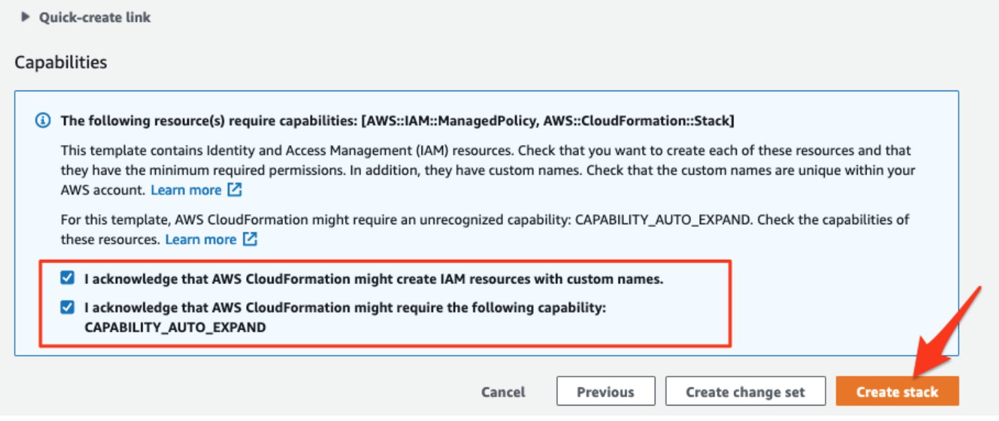
* Wait about 20 minutes for it deploy!
### Step 2: Connect to ParallelCluster UI 
* Go to the AWS Console, log in and in the search box search for AWS CloudFormation and click on that service: [link to console](https://us-east-2.console.aws.amazon.com/cloudformation/home?region=us-east-2#/stacks?filteringText=&filteringStatus=active&viewNested=true)
* You’ll see a stack named **parallelcluster-ui**, click on that **stack > Outputs Tab**
* Then click on the **ParallelClusterUI URL** to connect
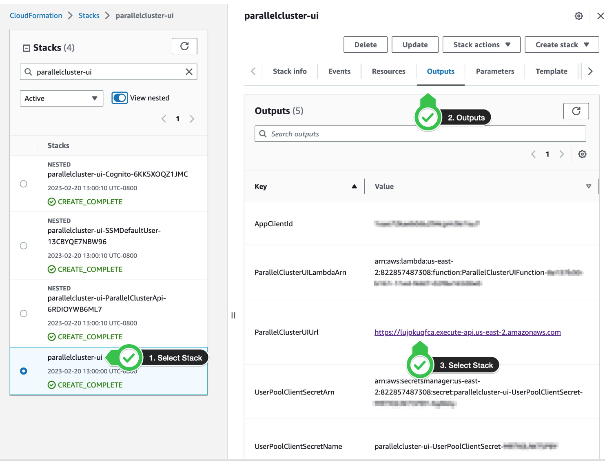
* You will see a prompt to enter your email and password

    * During deployment you should have received an email titled [AWS ParallelCluster UI] "Welcome to ParallelCluster UI, please verify your account" **Copy** the password from that email.
    * Enter the credentials using the email you used when deploying the stack and the temporary password from the email above
    * You will be asked to provide a new password. Enter a new password to complete signup
### Step 3: Create a new AWS EC2 key-pair for our lab
Next, we will create a new AWS EC2 key-pair so that we can eventually authenticate and connect to the cluster we are going to provision.

* Go to the AWS Console, and click on the button for CloudShell at the navbar at the top (or use this [link](https://us-east-2.console.aws.amazon.com/cloudshell/home?region=us-east-2#c4d15cb1-470b-4812-8893-cbb532feceba))


* Run the following in CloudShell to create a new EC2 key-pair `pcluster-demo-key`, and set the permissions correctly
```
aws ec2 create-key-pair --key-name pcluster-demo-key --query KeyMaterial --output text > pcluster-demo-key.pem
chmod 400 pcluster-demo-key
```
* Running `aws ec2 describe-key-pairs` should verify your key was created, and output something similar to:
```
{
    "KeyPairs": [
        {
            "KeyPairId": "key-0db2dfab426dc844a",
            "KeyFingerprint": "<redacted>",
            "KeyName": "pcluster-demo-key",
            "KeyType": "rsa",
            "Tags": [],
            "CreateTime": "2023-11-08T03:56:25.853000+00:00"
        }
    ]
}
```

### Step 4: Get to the AWS ParallelCluster page - Repeat first 3 bullet points of step 2
* Go to the AWS Console, log in and in the search box search for AWS CloudFormation and click on that service: [link to console](https://us-east-2.console.aws.amazon.com/cloudformation/home?region=us-east-2#/stacks?filteringText=&filteringStatus=active&viewNested=true)
* You’ll see a stack named **parallelcluster-ui,** click on that **stack > Outputs Tab**
* Then click on the **ParallelClusterUI URL** to connect

* If asked for password enter the email and new password you created in step 2
### Step 4: Create your Cluster - 10-15 minutes to deploy
* **Save this template**: https://www.hpcworkshops.com/template/cluster-config-hpc6a.yml
* Click **Create Cluster** Button and **with a template** and then open the template above
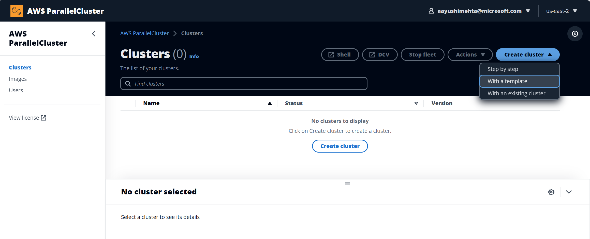
* **Cluster properties** page
  * Add **name**: hpc-cluster
  * Select **VPC** and click whatever is available
  * Click **Next**
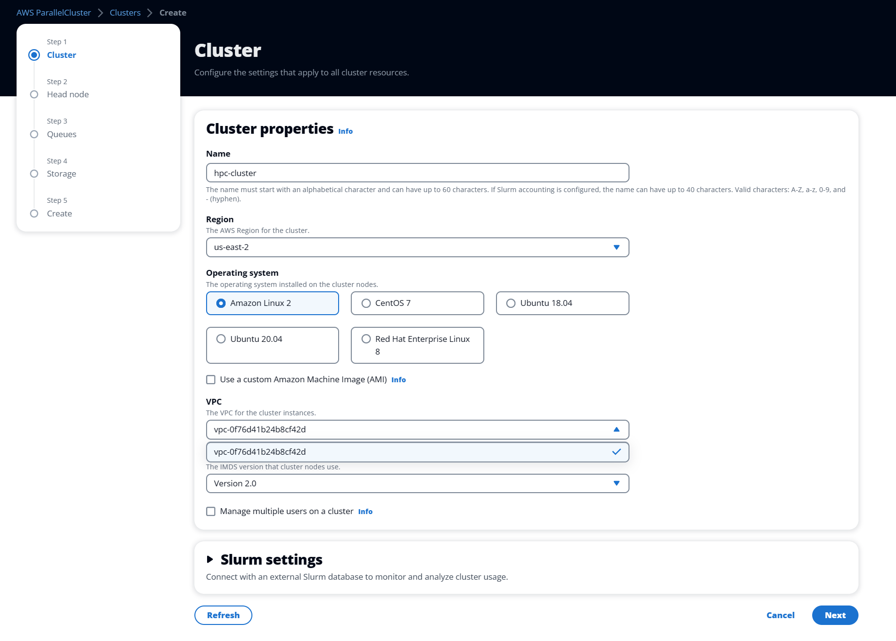
* **Head Node** page - screenshot slightly different than current page but same inputs required
  * Pick the **subnet id** from the Availability Zone ID **use2-az2**
  * If available, select the **Key pair** we just created `pcluster-demo-key` from the dropdown options (OK if it's not in the list) 
  * Click **Next**
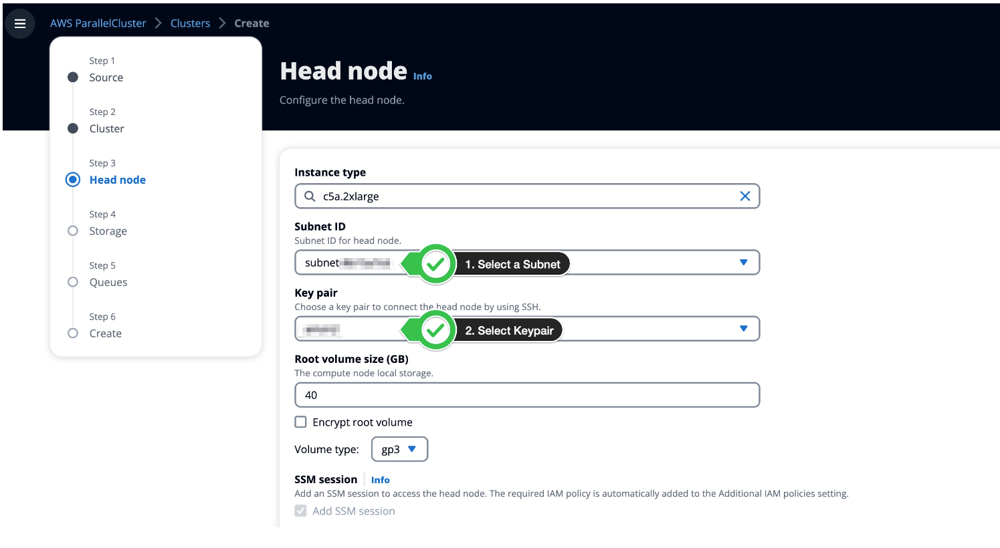
* **Queues**
  * At **subnet IDs** click the same subnet id you chose above
  * Click **Next**
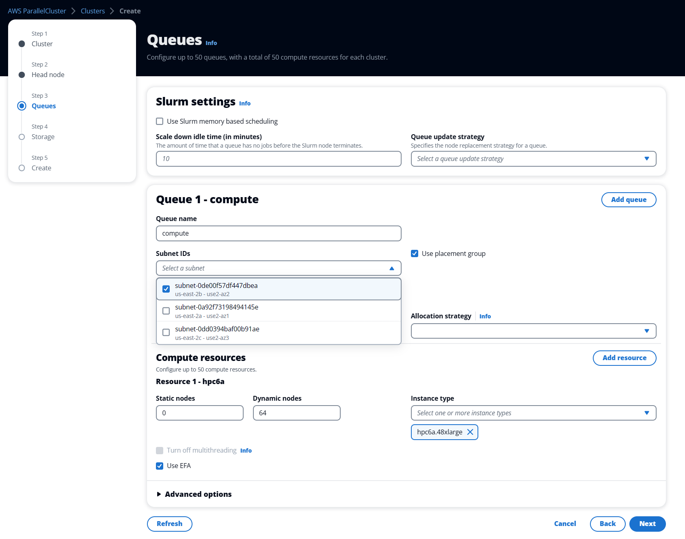
* **Storage**
  * Click **Next**
* **Create**
  * Ensure or edit so that the `KeyName` in the shown configuration matches the name of the key-pair we created in Step 3
    ```
    Ssh:
       KeyName: pcluster-demo-key
    ```
  * Click **Dry run** and make sure it passes that
  * Click **Create**!
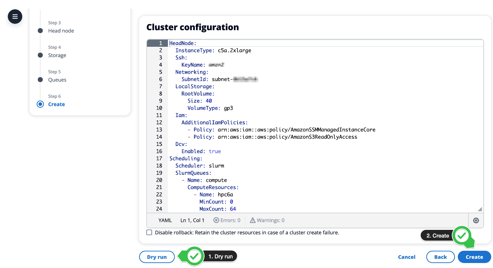
* Wait about 10-15 minutes for the cluster to go into **CREATE COMPLETE** and the compute fleet status to be running!

### Step 5: Set up AWS ParallelCluster CLI (command line interface)
* Go to CloudShell in the AWS console navbar at the top as we did in Step 3, or use this [link](https://us-east-2.console.aws.amazon.com/cloudshell/home?region=us-east-2#c4d15cb1-470b-4812-8893-cbb532feceba))
* CloudShell should have python3 installed. Run the following to upgrade/install `pip`, which is then used to install our ParallelCluster CLI
```
python3 -m pip install --upgrade pip
```
* Run the following to install the ParallelCluster CLI
```
python3 -m pip install "aws-parallelcluster" --upgrade --user
```
* Check it was installed by running `pcluster version`, which should return something like:
```
{
  "version": "3.7.0"
}
```
* Then, run `pcluster list-clusters` to get the status of the cluster we just provisioned:
```
{
  "clusters": [
    {
      "clusterName": "hpc-cluster",
      "cloudformationStackStatus": "CREATE_COMPLETE",
      "cloudformationStackArn": "arn:aws:cloudformation:us-east-2:483406226049:stack/hpc-cluster/9c712710-7de8-11ee-a446-0a300d84bf5f",
      "region": "us-east-2",
      "version": "3.7.2",
      "clusterStatus": "CREATE_COMPLETE",
      "scheduler": {
        "type": "slurm"
      }
    }
  ]
}
```

### Step 6: Connect to the cluster using DCV
* Once our cluster goes into **CREATE COMPLETE** (can be checked in the ParallelCluster UI console, or by running `pcluster list-clusters` as in Step 5), we can connect to the head node

_NOTE: This next step should be done quickly so the created DCV session does not close_
* Continuing in CloudShell, run the following, substituting where appropriate
```
pcluster dcv-connect -n <clusterName> -r <region> --key-path <path_to_generated_PEM_file_from_Step 3>
```
Example:
```
pcluster dcv-connect -n hpc-cluster -r us-east-2 --key-path ./pcluster-demo-key.pem
```

You should see output similar to:
```
...
Unable to open the Web browser.
Please use the following one-time URL in your browser within 30 seconds:
https://3.143.224.87:8443?authToken=kgBhbAVdZQIiulCmdtSoPGR99mreAYSGTbUCv_vgP2_c9cDbuqJRU7pViMxT7Abbka9tVeMIcXy1E-izJBpMcaKjOqvT2D6j2rLQ2_8NgE5mGkTXGwvvAFb4y4OdElVzLhLq1uPIB68EVDCIaUimZ-KmtIhUUGQhx7Ei6vQsvjGguqP_tOgGmNgdyM756hFOmOWl0dOj3TmRoaNPO8fmfm5M3vev7DxmqSbcwzrQC8WxUYAb7KX_nf5N_JS4N6ep#wUjc1fquAlHwCKt6Qw2o
```
This is *good*! Follow the instructions, and copy-paste the provided URL into a new tab in your web browser.

* As a one time step since the DCV viewer site uses third-party certificates you may need to click on a variation of **Advanced> Proceed to Unsafe**
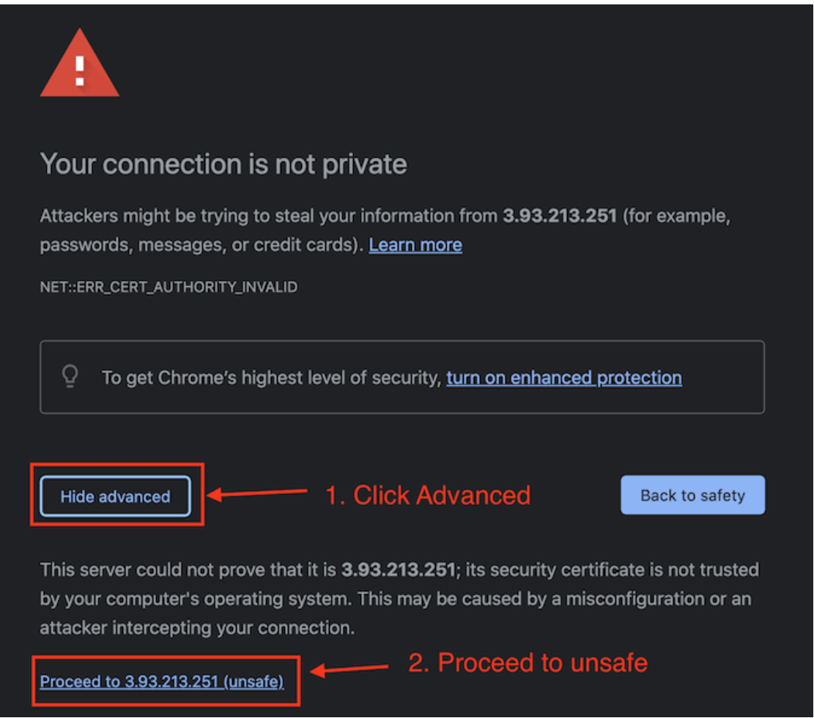
* Next to Launch a terminal we'll click **Activities** and then **Terminal**
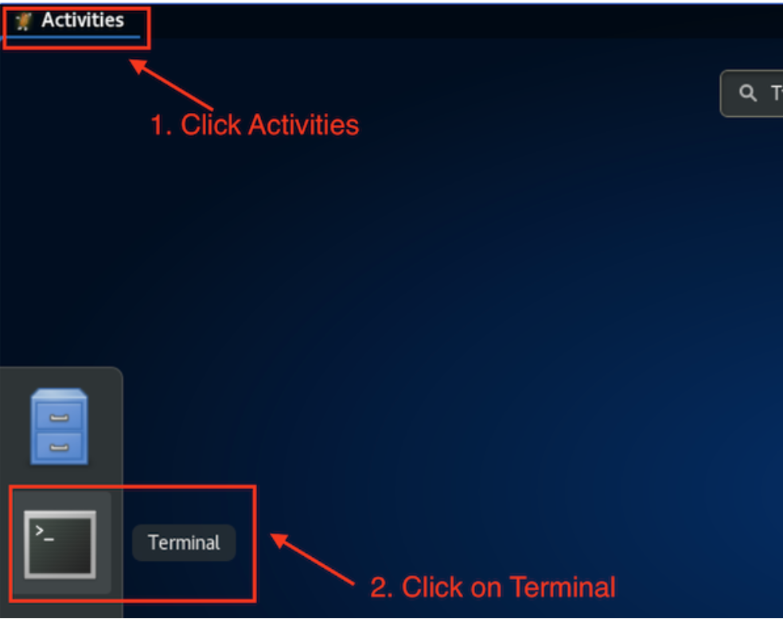

_NOTE: if you're not seeing **Activities** at any point, you may need to click around in the DCV_

### Step 7: Submit HPC job using control code for smallest prime factor
1. To demonstrate ParallelCluster's HPC capabilities, we will first write a program to calculate the smallest prime factor of a large integer.
It will run the function `calcMinPrimeFactor` on the same input 4 times within a single ParellelCluster process.

Within the ***DCV terminal***, copy-paste and run the following to save the program to the file `mpi_control_least_prime_factor.c`
```
cat > mpi_control_least_prime_factor.c << EOF
#include <stdio.h>
#include <stdlib.h>
#include <mpi.h>
#include <unistd.h>
#include <time.h>

// Function declaration
unsigned long long int calcMinPrimeFactor(unsigned long long int n);

int main(int argc, char* argv[]) {
    // Initialize MPI execution environment
    MPI_Init(&argc, &argv);

    unsigned long long int taskInputs[] = { 18848997157, 18848997157, 18848997157, 18848997157 };
    unsigned long long int taskOutputs[4];
    
    // Benchamrk runtime. Start clock...
    clock_t t;
    t = clock();

    // Re-calculate the minimum prime factor 4 times
    int i;
    for (i = 0; i < 4; i++) {
        taskOutputs[i] = calcMinPrimeFactor(taskInputs[i]);
    }

    // Stop clock, and calculate elapsed time
    t = clock() - t;
    double time_taken = 1000000 * ((double) t) / CLOCKS_PER_SEC; 

    // Print out elapsed time and results
    for (i = 0; i < 4; i++) {
        printf("Minimum prime factor of %d is %d\n", taskInputs[i], taskOutputs[i]);
    }
    printf("Time taken: %.2f micro-seconds\n", time_taken);// calculate the elapsed time

    // MPI finalization
    MPI_Finalize();

    return 0;
}

unsigned long long int calcMinPrimeFactor(unsigned long long int n) {
    // Function implementation
    unsigned long long int i;

    // Iterate from 2 to n/2.
    // This is because you only need to cover the first half
    // For example, if a * b = c; a = (c / 2), b = 2; if a > c/2, then b < 2
    for (i = 2; i <= (n / 2); i++) {
        // Check if i is a factor of n
        if (n % i == 0) {
            // Check if i is prime
            unsigned long long int j, is_prime = 1;
            // Check if i is divisible by all factors in [2, i / 2]
            for (j = 2; j <= (i / 2); j++) {
                // If divisible by j, then i is not prime
                if (i % j == 0) {
                    is_prime = 0;
                    break;
                }
            }
            if (is_prime) {
                // Found min prime factor
                return i;
            }
        }
    }

    // If no prime factor was found, n is prime
    return n;
}
EOF
```

2. Then, run the following to load the required modules and compile the application
```
module load intelmpi
mpicc mpi_control_least_prime_factor.c -o mpi_control_least_prime_factor
```

3. Execute the application on the head node using a single process (specified by `-n 1`)
```
mpirun -n 1 ./mpi_control_least_prime_factor
```

This should print out the computed least prime factor, and give you a runtime of the process as follows:

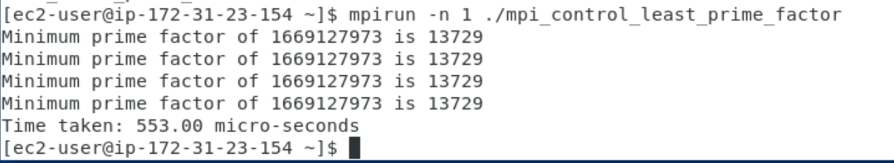


### Step 7: Submit HPC job on finding minimum prime factor
1. Now, we'll do the same using MPI code designed to run in parallel across multiple concurrent processes.
It will run the function `calcMinPrimeFactor` on the 4 inputs scattered across 4 concurrent parallel processes.

Within the ***DCV terminal***, copy-paste and run the following to save the program to the file `mpi_parallel_least_prime_factor.c`
```
cat > mpi_parallel_least_prime_factor.c << EOF
#include <stdio.h>
#include <stdlib.h>
#include <mpi.h>
#include <unistd.h>
#include <time.h>

// Function declarations
unsigned long long int calcMinPrimeFactor(unsigned long long int n);

int main(int argc, char* argv[]) {
    // MPI initialization
    MPI_Init(&argc, &argv);

    // 4 task inputs, corresponding to each of the 4 processes
    unsigned long long int taskInputs[4] = { 18848997157, 18848997157, 18848997157, 18848997157 };
    unsigned long long int subtaskInput;
    int process_rank;

    // Store the process # of the currently executing process in process_rank
    MPI_Comm_rank(MPI_COMM_WORLD, &process_rank);

    // Instruction to scatter inputs from taskInputs, and store the current process' assigned problem in subtaskInput 
    MPI_Scatter(&taskInputs, 1, MPI_UNSIGNED_LONG_LONG, &subtaskInput, 1, MPI_UNSIGNED_LONG_LONG, 0, MPI_COMM_WORLD);

    // Benchamrk runtime. Start clock...
    clock_t t;
    t = clock();

    // Calculate mininmum prime factor of subtaskInput
    unsigned long long int minPrimeFactor = calcMinPrimeFactor(subtaskInput);

    // Stop clock, and calculate elapsed time
    t = clock() - t;
    double time_taken = 1000000 * ((double) t) / CLOCKS_PER_SEC;

    // Print out elapsed time and results
    printf("Process %d: Time taken: %.2f micro-seconds\n", process_rank, time_taken);// calculate the elapsed time
    printf("Process %d: Minimum prime factor of %d is %d\n", process_rank, subtaskInput, minPrimeFactor);

    // MPI finalization
    MPI_Finalize();

    return 0;
}

unsigned long long int calcMinPrimeFactor(unsigned long long int n) {
  // Function implementation
  unsigned long long int i;

  // Iterate from 2 to n/2.
  // This is because you only need to cover the first half
  // For example, if a * b = c; a = (c / 2), b = 2; if a > c/2, then b < 2
  for (i = 2; i <= (n / 2); i++) {
      // Check if i is a factor of n
      if (n % i == 0) {
          // Check if i is prime
          unsigned long long int j, is_prime = 1;
          // Check if i is divisible by all factors in [2, i / 2]
          for (j = 2; j <= (i / 2); j++) {
              // If divisible by j, then i is not prime
              if (i % j == 0) {
                  is_prime = 0;
                  break;
              }
          }
          if (is_prime) {
              // Found min prime factor
              return i;
          }
      }
  }

  // If no prime factor was found, n is prime
  return n;
}
EOF
```

2. Then, run the following to load the required modules and compile the application
```
module load intelmpi
mpicc mpi_parallel_least_prime_factor.c -o mpi_parallel_least_prime_factor
```

3. Execute the application on the head node using 4 processes (specified by `-n 4`)
```
mpirun -n 4 ./mpi_parallel_least_prime_factor
```

This should print out the computed least prime factor, and give you a runtime of each of the processes as follows:


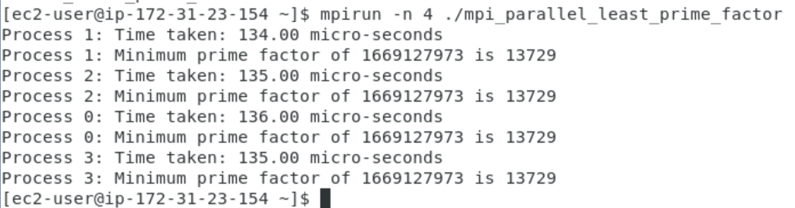


### Step 8: Compare your two runtimes!
* The runtime to find the smallest prime factor for four numbers using parallel computing should take signifcantly shorter amount of time than the runtime to find the same problem without it. As we can see in my above example, the control output took 553 microseconds while the code running in parallel had a maximum total run time of 136 microseconds. As we can see using parallel computing reduced the run time significantly.

### Step 9: Clean up!
* Make sure to go back to the AWS Parallel Cluster page and hit the delete button and delete your node!
* The cluster and all its resources will be deleted by CloudFormation. You can check the status in the Stack Events tab.

