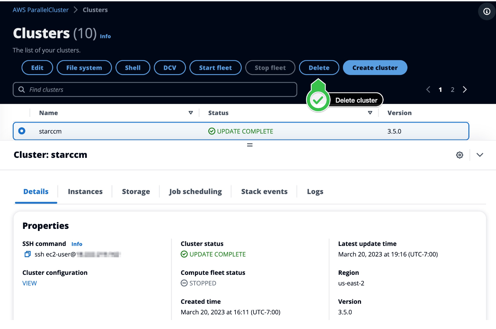

# HPC: Azure-Cycle-Cloud-vs-AWS-Parallel-Cluster

## Overview
In this tutorial, you will go through the basics of using AWS Parallel Cluster. This tutorial will walk you through how to create and connect to a HPC cluster in AWS and a use case on how to submit an HPC job. We will be using the problem of finding the smallest prime factor as an example.

### Step 0: Before You Start 
* AWS Account - Sign up for a free AWS account here : https://aws.amazon.com/free/?trk=7d839240-0f22-461a-924a-bd9f4c9f3138&sc_channel=ps&s_kwcid=AL!4422!10!71399763847723!71400284985686&ef_id=bc458f06349b10643121eb2a92f9869c:G:s&all-free-tier.sort-by=item.additionalFields.SortRank&all-free-tier.sort-order=asc&awsf.Free%20Tier%20Types=*all&awsf.Free%20Tier%20Categories=*all

### Step 1: Deploy ParallelCluster UI - 20 minutes to deploy
* Deploy the UI stack by going on this link:https://us-east-2.console.aws.amazon.com/cloudformation/home?region=us-east-2#/stacks/create/review?stackName=parallelcluster-ui&templateURL=https://parallelcluster-ui-release-artifacts-us-east-1.s3.us-east-1.amazonaws.com/parallelcluster-ui.yaml
* Update the field AdminUserEmail with a valid email to receive a temporary password in order to connect to the ParallelCluster UI GUI

* Leave the other default values and proceed through the next few pages till you are at stage 4
* At stage 4 click the two tick boxes to create new IAM resources
* Then click **Create stack **

* Wait about 20 minutes for it deploy!
### Step 2: Connect to ParallelCluster UI 
* Go to the AWS Console, in the search box search for AWS CloudFormation and click on that service.
    https://us-east-2.console.aws.amazon.com/cloudformation/home?region=us-east-2#/stacks?filteringText=&filteringStatus=active&viewNested=true
* You’ll see a stack named parallelcluster-ui, click on that stack > Outputs Tab then click on the ParallelClusterUIURL to connect.

* During deployment you received an email titled [AWS ParallelCluster UI] Welcome to ParallelCluster UI, please verify your account.
* Enter the credentials using the email you used when deploying the stack and the temporary password from the email above
* You will be asked to provide a new password. Enter a new password to complete signup.

### Step 3: Create your Cluster - 10-15 minutes to deploy
* Save this template: https://www.hpcworkshops.com/template/cluster-config-hpc6a.yml
* Navigate to AWS portal and type in AWS Parallel Cluster 
* Click **Create Cluster** Button and **with a template** and then select the template above

* Cluster properties page
  * Add name: hpc-cluster
  * select whichever VPC is available

* Head Node page
  * Pick the subnet id from the Availability Zone ID use2-az2
  * Click Key pair and choose None (make sure to click None or it might not work)

* Queues
  * At subnet IDs click the same subnet you chose above

* Storage - click next
* Create
  * Click Dry run and make sure it passes that
  * then click create!

* Wait about 10-15 minutes for the create to complete and the compute fleet status to be running!

### Step 4: Connect to the cluster using DCV
* Once the cluster goes into CREATE COMPLETE we can connect to the head node
* Click on DCV

* As a one time step since DCV uses self-signed certificates you'll need to click on Advanced> Proceed to Unsafe

* Next to Launch a terminal we'll click activities and then Terminal

### Step 5: Submit HPC job on finding minimum prime factor
1. Create the MPI application for smallest prime factor
Run the commands below:
```
cat > mpi_least_prime_factor.c << EOF
#include <stdio.h>
#include <stdlib.h>
#include <mpi.h>
#include <unistd.h>
#include <time.h>

// Function declarations
unsigned long long int calcMinPrimeFactor(unsigned long long int n);

int main(int argc, char* argv[]) {
    // MPI initialization
   
    int process_rank, size_of_comm;
    unsigned long long int taskInputs[4] = {18848997157, 18848997157, 18848997157, 18848997157};
    unsigned long long int subtaskInput;

    MPI_Init(&argc, &argv);
    MPI_Comm_size(MPI_COMM_WORLD, &size_of_comm);
    MPI_Comm_rank(MPI_COMM_WORLD, &process_rank);

    MPI_Scatter(&taskInputs, 1, MPI_UNSIGNED_LONG_LONG, &subtaskInput, 1, MPI_UNSIGNED_LONG_LONG, 0, MPI_COMM_WORLD);

    // Call your functions within the MPI program
    clock_t t;
    t = clock(); // start timer
    unsigned long long int minPrimeFactor = calcMinPrimeFactor(subtaskInput);
    t = clock() - t;
    double  time_taken =1000000 * ((double) t) / CLOCKS_PER_SEC; // calculate the elapsed time
    printf("Process %d: Time taken: %.2f micro-seconds\n", process_rank, time_taken);// calculate the elapsed time
    printf("Process %d: Minimum prime factor of %d is %d\n", process_rank, subtaskInput, minPrimeFactor);

    // MPI finalization
    MPI_Finalize();

    return 0;
}

unsigned long long int calcMinPrimeFactor(unsigned long long int n) {
  // Function implementation
  // You can use MPI features in your function if needed
  unsigned long long int i;

  // Iterate from 2 to n/2
  for (i = 2; i <= n/2; i++) {
      // Check if i is a factor of n
      if (n % i == 0) {
          // Check if i is prime
          unsigned long long int j, is_prime = 1;
          for (j = 2; j <= i/2; j++) {
              if (i % j == 0) {
                  is_prime = 0;
                  break;
              }
          }
          if (is_prime) {
              // Found min prime factor
              return i;
          }
      }
  }

  // If no prime factor was found, n is prime
  return n;
}
EOF

module load intelmpi
mpicc mpi_least_prime_factor.c -o mpi_least_prime_factor

```
Test application locally on head node 
```
mpirun -n 4 ./mpi_least_prime_factor

```
This should give you a runtime of the process split up, with each of the functions computing the prime factors happening at the same time. The max runtime shown gives an idea of the maximum time it took to complete all four processes.


### Step 6: Submit HPC job using control code for smallest prime factor
1. Create the MPI application for smallest prime factor control
Run the commands below:
```
#include <stdio.h>
#include <stdlib.h>
#include <mpi.h>
#include <unistd.h>
#include <time.h>

// Function declarations
unsigned long long int calcMinPrimeFactor(unsigned long long int n);

int main(int argc, char* argv[]) {
    // MPI initialization
    int  process_rank,size_of_comm;

    MPI_Init(&argc, &argv);
    MPI_Comm_size(MPI_COMM_WORLD, &size_of_comm);
    MPI_Comm_rank(MPI_COMM_WORLD, &process_rank);


    // Call your functions within the MPI program
    clock_t t;
    t = clock(); // start timer
    unsigned long long int num= 18848997157;
    unsigned long long int minPrimeFactor = calcMinPrimeFactor(num);
     printf(" Minimum prime factor of %d is %d\n", num, minPrimeFactor);
    minPrimeFactor = calcMinPrimeFactor(num);
     printf(" Minimum prime factor of %d is %d\n", num, minPrimeFactor);
     minPrimeFactor = calcMinPrimeFactor(num);
     printf(" Minimum prime factor of %d is %d\n", num, minPrimeFactor);
    minPrimeFactor = calcMinPrimeFactor(num);
     printf(" Minimum prime factor of %d is %d\n", num, minPrimeFactor);

    t = clock() - t;
    double time_taken =1000000* ((double) t) / CLOCKS_PER_SEC; // calculate the elapsed time
    printf(" Time taken: %.2f micro-seconds\n", time_taken);// calculate the elapsed time

    // MPI finalization
    MPI_Finalize();

    return 0;
}

unsigned long long int calcMinPrimeFactor(unsigned long long int n) {
  // Function implementation
  unsigned long long int i;

  // Iterate from 2 to n/2
  for (i = 2; i <= n/2; i++) {
      // Check if i is a factor of n
      if (n % i == 0) {
          // Check if i is prime
          unsigned long long int j, is_prime = 1;
          for (j = 2; j <= i/2; j++) {
              if (i % j == 0) {
                  is_prime = 0;
                  break;
              }
          }
          if (is_prime) {
              // Found min prime factor
              return i;
          }
      }
  }

  // If no prime factor was found, n is prime
  return n;
}

EOF

module load intelmpi
mpicc mpi_control_least_prime_factor.c -o mpi_control_least_prime_factor

```
Test application locally on head node 
```
mpirun -n 4 ./mpi_control_least_prime_factor

```
This should give you a runtime of the process without using parallel computing with four seperate numbers running through the function one by one. The runtime shown gives an idea of the maximum time it took to complete all four processes.

### Step 7: Compare your two runtimes!
* The runtime to find the smallest prime factor for four numbers using parallel computing should take signifcantly shorter amount of time than the runtime to find the same problem without it.
### Step 5: Clean up!
* Make sure to go back to the AWs Parallel Cluster page and hit the delete button and delete your node!
* The cluster and all its resources will be deleted by CloudFormation. You can check the status in the Stack Events tab.

