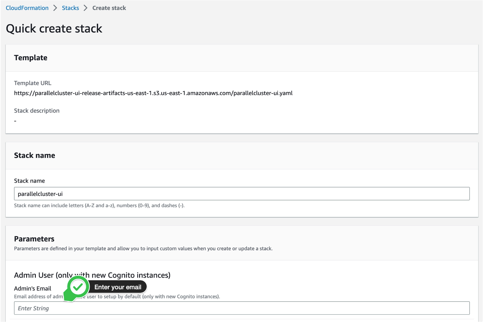

d# HPC: Azure-Cycle-Cloud-vs-AWS-Parallel-Cluster

## Overview
In this tutorial, you will go through the basics of using AWS Parallel Cluster. This tutorial will walk you through how to create and connect to a HPC cluster in AWS and a use case on how to submit an HPC job. We will be using the problem of finding the smallest prime factor as an example

### Step 0: Before You Start 
* Sign up for a free AWS account here [AWS Account Sign Up](https://aws.amazon.com/free/?trk=7d839240-0f22-461a-924a-bd9f4c9f3138&sc_channel=ps&s_kwcid=AL!4422!10!71399763847723!71400284985686&ef_id=bc458f06349b10643121eb2a92f9869c:G:s&all-free-tier.sort-by=item.additionalFields.SortRank&all-free-tier.sort-order=asc&awsf.Free%20Tier%20Types=*all&awsf.Free%20Tier%20Categories=*all)

### Step 1: Deploy ParallelCluster UI - 20 minutes to deploy
* Create UI stack [here](https://us-east-2.console.aws.amazon.com/cloudformation/home?region=us-east-2#/stacks/create/review?stackName=parallelcluster-ui&templateURL=https://parallelcluster-ui-release-artifacts-us-east-1.s3.us-east-1.amazonaws.com/parallelcluster-ui.yaml)
* Update the field AdminUserEmail with a valid email to receive a temporary password in order to connect to the ParallelCluster UI GUI

* Leave the other default values and proceed through the next few pages till you are at stage 4
* At stage 4 click the two tick boxes to create new IAM resources
* Then click **Create stack **

* Wait about 20 minutes for it deploy!
